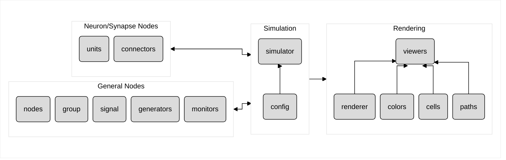

# Circuits

This library provides a neural circuits architecture builder based on PyTorch. It enables different types of circuit elements (*nodes*) to be connected into a static multilevel graph (*circuit tree*). The resulting circuit tree is a `torch.nn.Module` that can be simulated, rendered, and easily integrated into an external PyTorch model.

## Organization

This library is organized into modules that implement nodes, a simulation manager, and a rendering engine:



## Usage

This example creates a half-center oscillator circuit with 2 neurons, then simulates and renderers it for 5000 ms.

```python
import torch
import numpy as np

import circuits as cc
import circuits.rendering as ccr

# Optional: For rendering, this library displays images/videos in a Jupyter notebook.
import mediapy


def half_center_oscillator(**kwargs):
  # Create a simulator.
  sim = cc.Simulator(**kwargs)

  # Create units and connectors.
  # For rendering, can add metadata (e.g. `xy`, `flow`, `sign`) as keyword arguments.
  # Listings of available metadata options are provided in the `circuits.rendering` modules.
  sim.flx = flx = cc.Oscillator(bias=0.2, xy=(5, -5), decorator='~')
  sim.ext = ext = cc.Basic(bias=0.8, xy=(5, 5), flow='left')
  flx.synapse(ext, weight=-0.1, sign='-')
  ext.synapse(flx, weight=-0.9, sign='-')

  # Create monitor for debugging.
  sim.monitor = cc.TimeseriesMonitor(xy=(-8, -1), ylim=(0, 1)).connect(flx).connect(ext)

  return sim


def run(
  sim: cc.Simulator,
  T: float = 5000,
  seed: int = 0,
  image: bool = False,
  video: bool = False,
  fps: float = 20,
  **kwargs,
):
  # Set seeds.
  torch.manual_seed(seed)
  np.random.seed(seed)

  # Initialize simulator.
  sim.init()
  print(sim)

  # Initialize renderer.
  renderer = ccr.Renderer(sim, **kwargs)

  # Run simulation/rendering loop.
  dt = 1000 / fps
  render_time = 0
  frames = []
  if image: mediapy.show_image(renderer.render())       # Keep alpha channel for images.
  if video: frames.append(renderer.render()[:, :, :3])  # Ignore alpha channel for videos.
  while sim.time < T:
      sim.step()
      if video and (sim.time >= render_time or sim.time >= T):
        frames.append(renderer.render()[:, :, :3])
        render_time += dt
  if video: mediapy.show_video(frames, fps=fps)

  return renderer


sim = half_center_oscillator(
  # Simulator configuration overrides.
  timestep=50,
)
run(
  sim, T=5000, image=True, video=True,
  # Renderer settings / configuration overrides.
  xlim=(-10, 10), ylim=(-10, 10), grid_lines=True, grid_coords=True, label_timestamp=True,
)
```
