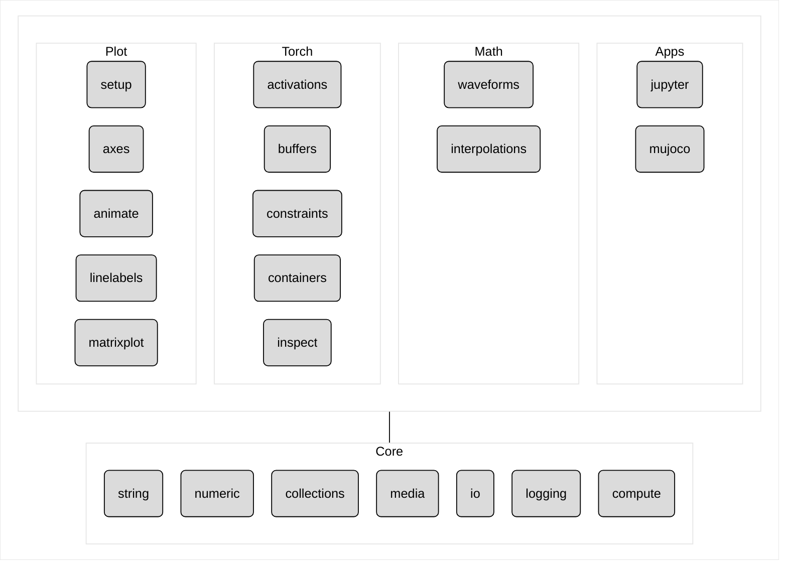

# Utils

This library provides utilities for data processing, math, visualization, etc.

```mermaid
%%{
  init: {
    'flowchart': {
      'htmlLabels': false,
      'nodeSpacing': 20,
      'rankSpacing': 10,
      'curve': 'stepBefore',
      'diagramPadding': 0
    },
    'theme': 'base',
    'themeVariables': {
      'darkMode': false,
      'fontFamily': 'Helvetica, Arial, sans-serif',
      'fontSize': '14px',
      'primaryColor': '#DBDBDB',
      'primaryTextColor': 'black',
      'primaryBorderColor': 'black',
      'lineColor': 'black',
      'secondaryColor': '#DBDBDB',
      'tertiaryColor': 'white'
    }
  }
}%%
flowchart
  classDef dummy fill:none,stroke:none,color:white
  classDef vspace fill:none,stroke:none,color:none,height:51px

  subgraph sg0[ ]
    direction BT

    subgraph sg_base[Core]
      direction BT
      string(string)
      numeric(numeric)
      collections(collections)
      media(media)
      io(io)
      logging(logging)
      compute(compute)
    end

    subgraph sg_1[ ]
      direction BT

      subgraph sg_apps[Apps]
        direction LR
        jupyter(jupyter)
        mujoco(mujoco)
        a1( ):::vspace
        a2( ):::vspace
        a3( ):::vspace
      end

      subgraph sg_math[Math]
        direction LR
        waveforms(waveforms)
        interpolations(interpolations)
        m1( ):::vspace
        m2( ):::vspace
        m3( ):::vspace
      end

      subgraph sg_torch[Torch]
        direction LR
        activations(activations)
        buffers(buffers)
        constraints(constraints)
        containers(containers)
        inspect(inspect)
      end

      subgraph sg_plot[Plot]
        direction LR
        setup(setup)
        axes(axes)
        animate(animate)
        linelabels(linelabels)
        matrixplot(matrixplot)
      end
    end

    sg_base --- sg_1
  end
```
